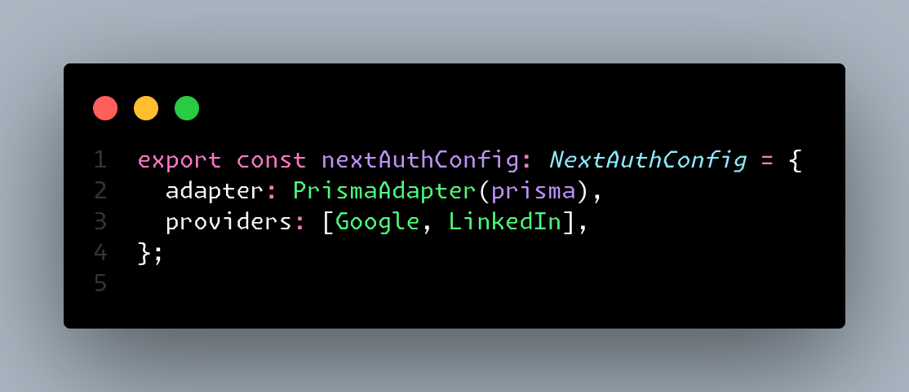
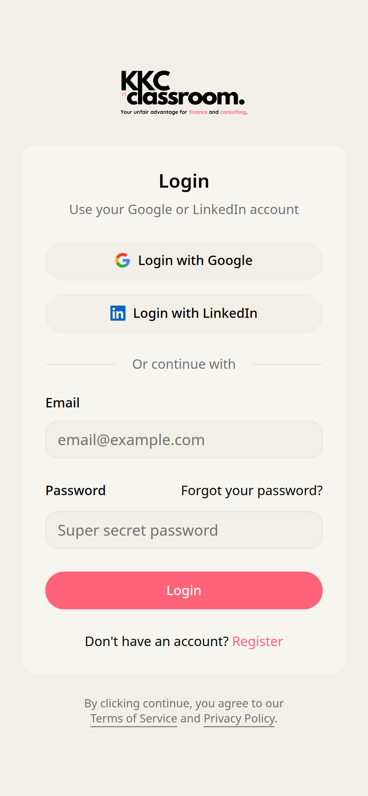

There's a significantly noticeable difference in being a developer on the team, and being the development team. Especially when you're the CTO and you're just starting out — you're responsible for everything from making architectural decisions to fixing the styling of the submit buttons. Now, I'm lucky we have some help, but it's still a lot of work.

As of writing this blog, it is currently the 22nd of August, and I have till the month ends to scrap a super basic version of the app together, making sure design and safety are fully prioritised.

## Background

For context, my co-founder [Ammar Khan](https://www.linkedin.com/in/ammarskhan/) was frustrated with the state of the available information on consulting and finance that young people can use to break into the industry, and so using his connections with industry experts and my knowledge in SSR, we're putting together a platform that can make people's lives easier.

At this stage, I have a data access layer and a working authentication hook + middleware support (both of which I need to migrate from Firebase to Auth.js and Prisma for obvious reasons).

Wish me luck!

## Day 1-2

Auth is hard. Don't get me wrong, I love Auth.js. Putting it simple, OAuth integration is smooth, email credentials suck.

Auth.js config before email credentials.

There are a couple of bugs still left to figure out, but I know I'm close. I'm determined to make this work. Since this is my first time using Auth.js, I can't really expect the same speed of development as I would with Supabase or Firebase, but I know that once I get the hang of it, it'll be smooth sailing.

Fortunately, even though the team is new, they're talented, which means I was able to put this beauty together.

Plan for the next couple of days is to get the authentication working, and then move on to the data access layer.

- Prisma: Added
- Schemas: working
- Migrations: Done
