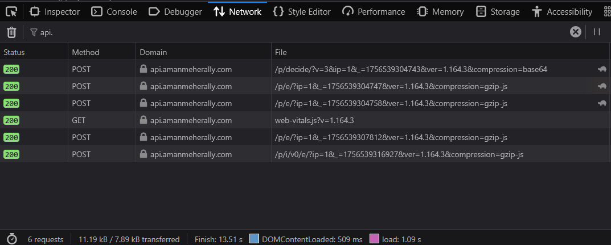
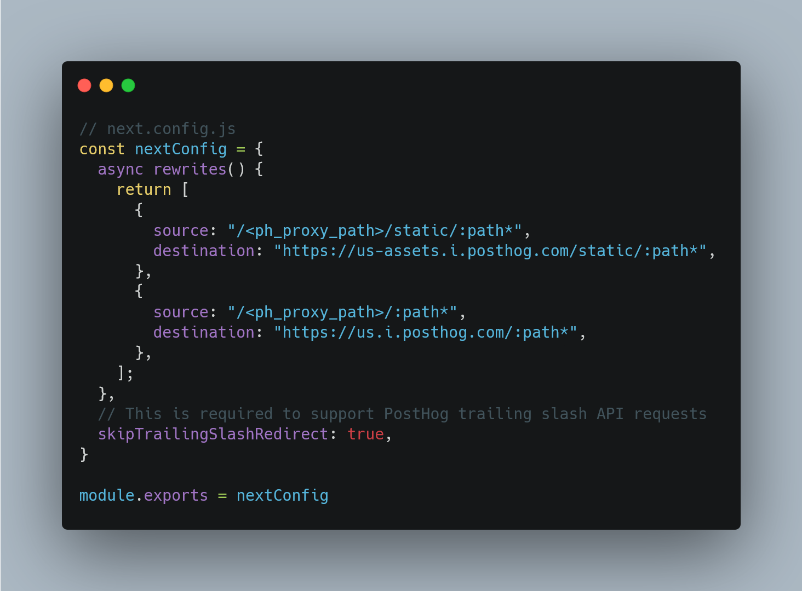
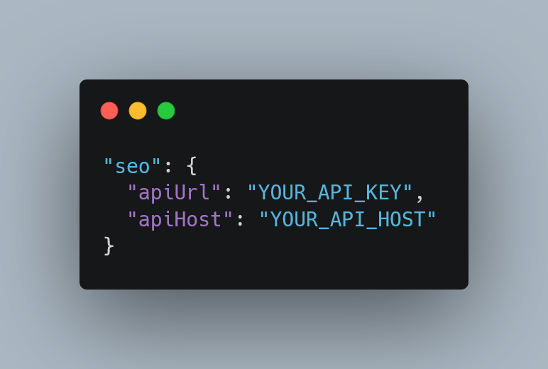
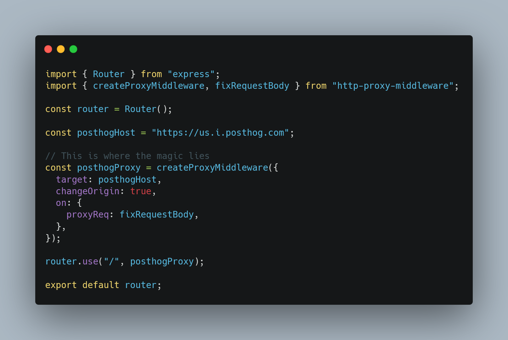

  "Beating Gemini" might be a bit of a stretch, but I promise this gets
  interesting.

## Crossing the Bridge

Every software engineer comes to a certain point in their career. The point where they stop centering a `div` and start being an "engineer". When they start hacking together solutions under tight constraints based on their understanding of the available tools and their creative thinking.

Sound familiar?

Before I continue, if you're on your desktop, open the network requests tab right now and refresh this page. If you search for requests from `api.`, you should see some requests that look like this.

We'll get to that in a second.

## The Backstory

Past a certain point of me working on my portfolio, I realized it was time to integrate analytics. So I looked up the Mintlify documentation, and sure enough, their Posthog integration was seamless.

There was just one problem though.

You see, the reason why you haven't seen an ad since you installed your ad blocker is because ad blockers are really good at what they do. So much so that they block analytics on the client because of the domain.

Bear in mind, Next JS comes with a solution built into this, and the brilliant engineers at Posthog have guides on how to solve this using re-writes.

If you're unfamiliar with HTTP rewrites, the idea is to route the request to your own server instead of to the chosen destination, and the server "silently forwards" it like a middleman. The pro is that on Next JS, it's on your own domain which doesn't flag anything. The con is your server handles the compute.

So I pulled up my trusty AI agent, and discovered after a good twenty minutes that there simply was no solution. Despite Mintlify compiling to Next JS, it was clear that they hadn't exposed any way to re-write Posthog requests. Which sucked.

But you could change the URL. In fact, the SDK let's you set exactly two values.

And once I realized this, the game was simple. I deployed an Express server to api.amanmeherally.com, set up an HTTP proxy middleware object on a router, and the rest was history.

## Here's my point

I don't think we'll ever get to the point where AI is going to be able to come up with these solutions. This wasn't that complicated to understand or put together (okay maybe an hour, but I don't use Express), but AI isn't a "problem solver".

And you know why AI isn't a problem solver. As the saying goes: garbage in, garbage out.
